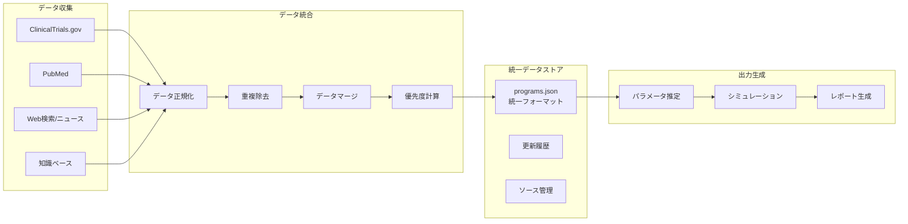

# データフローとドキュメント表示の改善計画

## 1. 現在のデータフローの問題点と改善案

### 1.1 データの重複と不整合

#### 現状の問題
```
現在の状況：
- ClinicalTrials.gov API → raw/clinical_trials/
- PubMed API → raw/literature/
- Web検索 → knowledge_base/
- 手動更新 → knowledge_base/

問題点：
- 同じ治療プログラムが複数の場所に存在
- データ更新タイミングがバラバラ
- どれが最新か分からない
```

#### 改善案：統一データモデルの導入
```python
# data/models/clinical_program.py
from dataclasses import dataclass
from datetime import datetime
from typing import List, Optional, Dict

@dataclass
class ClinicalProgram:
    """統一された臨床プログラムデータモデル"""
    # 基本情報
    program_id: str  # 例: "MCO-010"
    name: str
    company: str
    
    # 治療情報
    treatment_type: str  # "gene_therapy", "cell_therapy", "drug"
    target_genes: List[str]
    mechanism: str
    
    # 臨床試験情報
    nct_ids: List[str]  # 複数の試験がある場合
    current_phase: str
    trial_status: str
    
    # タイムライン
    phase_history: Dict[str, datetime]  # {"Phase 1": "2020-01-01", ...}
    expected_milestones: Dict[str, datetime]
    
    # データソース情報
    sources: Dict[str, Dict]  # {"clinicaltrials": {...}, "knowledge_base": {...}}
    last_updated: Dict[str, datetime]  # ソースごとの最終更新日
    
    # 優先度情報
    priority_score: float
    confidence_level: str  # "high", "medium", "low"
    
    def merge_with(self, other_data: Dict, source: str):
        """他のデータソースからの情報をマージ"""
        # 最新の情報を優先してマージ
        pass
```

### 1.2 データ処理パイプラインの整理

#### 新しいデータフロー


#### 実装例
```python
# src/data_pipeline/integrator.py
class DataIntegrator:
    """複数のデータソースを統合"""
    
    def integrate_all_sources(self):
        """全データソースを統合"""
        # 1. 各ソースからデータ取得
        ct_data = self.load_clinical_trials()
        kb_data = self.load_knowledge_base()
        
        # 2. プログラムIDで統合
        integrated = {}
        
        # ClinicalTrials.govデータを基準に
        for trial in ct_data:
            program_id = self.extract_program_id(trial)
            if program_id not in integrated:
                integrated[program_id] = ClinicalProgram(
                    program_id=program_id,
                    sources={'clinicaltrials': trial},
                    # ... 他のフィールド
                )
            else:
                integrated[program_id].merge_with(trial, 'clinicaltrials')
        
        # 知識ベースのデータをマージ
        for program_name, kb_info in kb_data.items():
            program_id = self.normalize_program_id(program_name)
            if program_id in integrated:
                integrated[program_id].merge_with(kb_info, 'knowledge_base')
            else:
                # 知識ベースにのみ存在するプログラム
                integrated[program_id] = self.create_from_kb(kb_info)
        
        return integrated
```

## 2. HTML表示項目の整理と改善

### 2.1 現在の表示の問題点

#### 問題
- 情報が多すぎて重要なポイントが分からない
- 専門用語が多く一般の人には理解しづらい
- モバイルでの表示が見づらい
- 更新情報が分かりにくい

### 2.2 情報の優先度付けと構造化

#### A. トップページ（index.html）の改善
```html
<!-- 新しい構成案 -->
<body>
    <!-- 1. 要約セクション（最重要） -->
    <section class="summary-hero">
        <h1>網膜色素変性症の治療法はいつ頃？</h1>
        <div class="key-findings">
            <div class="finding-card urgent">
                <h2>🎯 最も早い承認予測</h2>
                <p class="big-text">2026-2027年</p>
                <p>MCO-010（米国FDA）</p>
            </div>
            <div class="finding-card important">
                <h2>🇯🇵 日本での承認</h2>
                <p class="big-text">2031-2032年</p>
                <p>FDA承認の約5年後</p>
            </div>
            <div class="finding-card">
                <h2>📊 開発中の治療法</h2>
                <p class="big-text">15種類以上</p>
                <p>Phase 2以上: 8種類</p>
            </div>
        </div>
    </section>
    
    <!-- 2. タイムライン（視覚的に分かりやすく） -->
    <section class="timeline-section">
        <h2>承認予測タイムライン</h2>
        <div class="timeline-visual">
            <!-- SVGまたはCSSで視覚的なタイムライン -->
            <div class="timeline-item phase3">
                <span class="year">2026</span>
                <span class="program">MCO-010</span>
                <span class="status">BLA申請中</span>
            </div>
            <!-- ... -->
        </div>
    </section>
    
    <!-- 3. 注目の治療プログラム（上位5つに絞る） -->
    <section class="featured-programs">
        <h2>注目の治療プログラム TOP5</h2>
        <div class="program-cards">
            <!-- カード形式で見やすく -->
        </div>
    </section>
    
    <!-- 4. 最新アップデート（変更点を明確に） -->
    <section class="recent-updates">
        <h2>最新の更新情報</h2>
        <div class="update-list">
            <div class="update-item new">
                <span class="date">2024-07-24</span>
                <span class="badge">新規</span>
                <p>SPVN06が追加されました</p>
            </div>
            <!-- ... -->
        </div>
    </section>
</body>
```

#### B. プログラム詳細表示の改善
```python
# src/reporting/html_formatter.py
class ProgramCardFormatter:
    """プログラム情報をカード形式で表示"""
    
    def format_program_card(self, program: ClinicalProgram) -> str:
        """見やすいカード形式のHTML生成"""
        
        # 進捗度を計算（0-100%）
        progress = self.calculate_progress(program)
        
        # 重要度に応じてスタイルを変更
        card_class = self.get_card_class(program.priority_score)
        
        return f"""
        <div class="program-card {card_class}">
            <div class="card-header">
                <h3>{program.name}</h3>
                <span class="company">{program.company}</span>
            </div>
            
            <div class="progress-bar">
                <div class="progress-fill" style="width: {progress}%"></div>
                <span class="phase-label">{program.current_phase}</span>
            </div>
            
            <div class="card-details">
                <div class="detail-row">
                    <span class="label">治療タイプ:</span>
                    <span class="value">{self.translate_treatment_type(program.treatment_type)}</span>
                </div>
                <div class="detail-row">
                    <span class="label">対象遺伝子:</span>
                    <span class="value">{', '.join(program.target_genes) or '遺伝子非依存'}</span>
                </div>
                <div class="detail-row">
                    <span class="label">予測承認時期:</span>
                    <span class="value highlight">{self.format_approval_date(program)}</span>
                </div>
            </div>
            
            <div class="card-footer">
                <a href="#details-{program.program_id}" class="details-link">詳細を見る</a>
                <span class="update-date">更新: {program.last_updated}</span>
            </div>
        </div>
        """
```

### 2.3 レスポンシブデザインの改善

```css
/* styles/responsive.css */
/* モバイルファースト設計 */

/* ベース（モバイル） */
.container {
    padding: 16px;
    max-width: 100%;
}

.program-card {
    margin-bottom: 16px;
    padding: 16px;
    border-radius: 8px;
    box-shadow: 0 2px 4px rgba(0,0,0,0.1);
}

.timeline-visual {
    overflow-x: auto;
    -webkit-overflow-scrolling: touch;
}

/* タブレット (768px以上) */
@media (min-width: 768px) {
    .container {
        padding: 24px;
        max-width: 720px;
        margin: 0 auto;
    }
    
    .program-cards {
        display: grid;
        grid-template-columns: repeat(2, 1fr);
        gap: 20px;
    }
}

/* デスクトップ (1024px以上) */
@media (min-width: 1024px) {
    .container {
        max-width: 1200px;
    }
    
    .program-cards {
        grid-template-columns: repeat(3, 1fr);
    }
    
    .timeline-visual {
        overflow-x: visible;
    }
}

/* ダークモード対応 */
@media (prefers-color-scheme: dark) {
    body {
        background: #1a1a1a;
        color: #e0e0e0;
    }
    
    .program-card {
        background: #2a2a2a;
        box-shadow: 0 2px 4px rgba(0,0,0,0.3);
    }
}
```

## 3. データ更新フローの明確化

### 3.1 更新トリガーと処理フロー

```python
# src/update_manager.py
class UpdateManager:
    """データ更新を管理"""
    
    def __init__(self):
        self.update_log = []
        
    def check_updates_needed(self) -> Dict[str, bool]:
        """更新が必要な項目をチェック"""
        checks = {
            'clinical_trials': self.is_stale('clinical_trials', days=7),
            'knowledge_base': self.is_stale('knowledge_base', days=30),
            'parameters': self.is_stale('parameters', days=7),
            'reports': self.is_stale('reports', days=3)
        }
        return checks
    
    def perform_update(self, update_type: str = 'smart'):
        """スマート更新を実行"""
        
        if update_type == 'smart':
            # 必要な部分のみ更新
            needs_update = self.check_updates_needed()
            
            if needs_update['clinical_trials']:
                self.update_clinical_trials()
            
            if needs_update['knowledge_base']:
                self.update_knowledge_base()
                
            # パラメータは常に再計算
            if any(needs_update.values()):
                self.update_parameters()
                self.generate_reports()
                
        elif update_type == 'full':
            # 全て更新
            self.update_all()
```

### 3.2 差分更新の実装

```python
# src/diff_updater.py
class DiffUpdater:
    """差分のみを効率的に更新"""
    
    def update_html_diff(self, old_data, new_data):
        """HTMLの差分更新"""
        diff_sections = []
        
        # 新規プログラム
        new_programs = set(new_data.keys()) - set(old_data.keys())
        if new_programs:
            diff_sections.append({
                'type': 'new',
                'programs': new_programs
            })
        
        # 更新されたプログラム
        for program_id in set(new_data.keys()) & set(old_data.keys()):
            if self.has_significant_changes(old_data[program_id], new_data[program_id]):
                diff_sections.append({
                    'type': 'updated',
                    'program_id': program_id,
                    'changes': self.get_changes(old_data[program_id], new_data[program_id])
                })
        
        return self.generate_diff_html(diff_sections)
```

## 4. 実装優先順位

### Phase 1: データモデルの統一（1週間）
1. `ClinicalProgram`データクラスの実装
2. データ統合スクリプトの作成
3. 既存データの移行

### Phase 2: HTML表示の改善（1週間）
1. 情報の優先度付けロジック実装
2. レスポンシブテンプレートの作成
3. カード型UIの実装

### Phase 3: 更新フローの整備（3-4日）
1. スマート更新の実装
2. 差分検出と通知
3. 更新ログの可視化

この順序で実装することで、まずデータの一貫性を確保し、次に表示を改善し、最後に効率的な更新システムを構築できます。