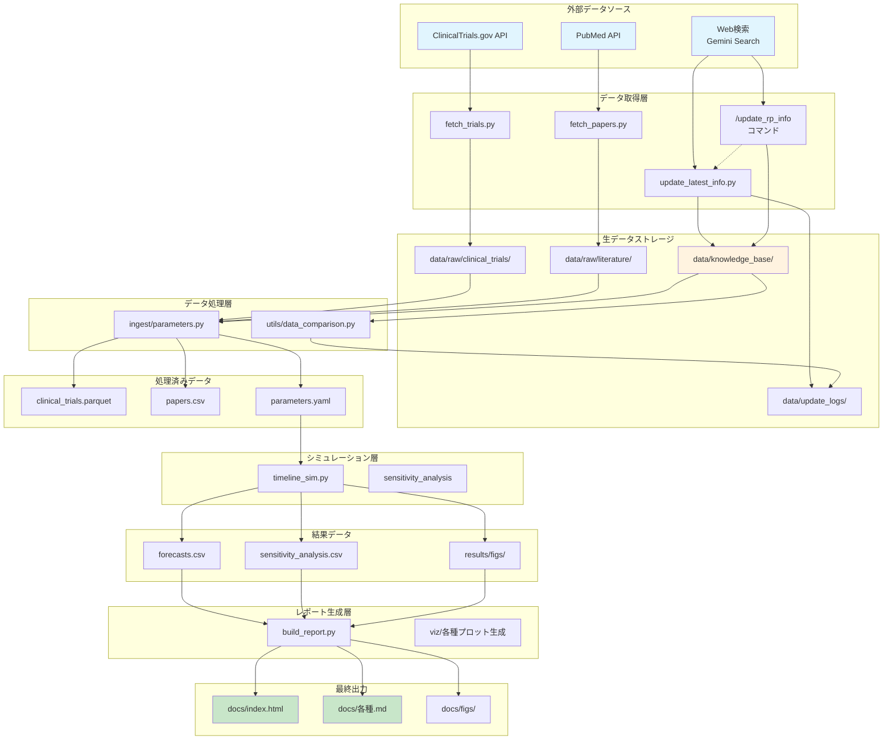
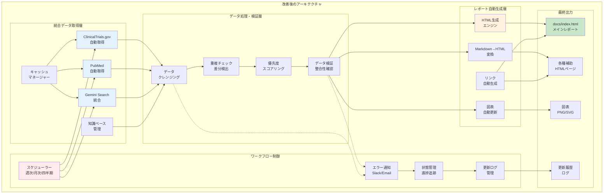

# 網膜色素変性症治療予測システム - 情報フロー分析

## 1. 現在の情報フロー概要

## 2. 各コンポーネントの詳細

### 2.1 データ取得層

#### ClinicalTrials.gov取得 (fetch_trials.py)
- **入力**: APIクエリパラメータ
- **処理**: 
  - 網膜色素変性症関連の臨床試験を検索
  - APIバージョン2を使用してデータ取得
  - JSONフォーマットで保存
- **出力**: `data/raw/clinical_trials/YYYYMMDD.json`

#### PubMed文献取得 (fetch_papers.py)
- **入力**: 検索クエリ
- **処理**:
  - 関連文献をPubMed APIから取得
  - 文献情報を構造化
- **出力**: `data/raw/literature/pubmed_YYYYMMDD.json`

#### 最新情報更新 (update_latest_info.py)
- **入力**: 知識ベース、Webからの最新情報
- **処理**:
  - Gemini Search経由でWeb検索
  - 既存データとの比較
  - 新規・更新情報の分類
  - 自動的な検索クエリ生成
- **出力**: 
  - `data/knowledge_base/clinical_programs.json`
  - `data/update_logs/`

### 2.2 データ処理層

#### パラメータ推定 (ingest/parameters.py)
- **入力**: 生データ（臨床試験、文献、知識ベース）
- **処理**:
  - データクレンジング
  - 成功率・期間の統計的推定
  - 優先度スコアリング
- **出力**: 
  - `data/processed/clinical_trials.parquet`
  - `data/processed/parameters.yaml`

### 2.3 シミュレーション層

#### タイムラインシミュレーション (timeline_sim.py)
- **入力**: parameters.yaml
- **処理**:
  - モンテカルロシミュレーション（10,000回/プログラム）
  - フェーズ遷移モデリング
  - 日本承認遅延の考慮
  - 感度分析
- **出力**:
  - `results/forecasts.csv`
  - `results/sensitivity_analysis.csv`
  - 各種図表

### 2.4 レポート生成層

#### レポートビルド (build_report.py)
- **入力**: シミュレーション結果、図表
- **処理**:
  - HTMLテンプレート生成
  - レスポンシブデザイン適用
  - OGPタグ追加
  - リンクの自動変換
- **出力**: `docs/`配下の各種HTMLファイル

## 3. 現在の課題点

### 3.1 データフローの課題
1. **重複処理**
   - Web検索が複数箇所で実行される可能性
   - パラメータ推定で同じデータを複数回読み込み

2. **手動プロセス**
   - 特定の更新は手動でトリガーが必要
   - エラー時の再実行が手動

3. **データの一貫性**
   - 知識ベースとAPIデータの同期タイミング
   - キャッシュデータの有効期限管理

### 3.2 パフォーマンスの課題
1. **順次処理**
   - データ取得が直列で実行
   - シミュレーションの並列化が不十分

2. **メモリ使用**
   - 大量のシミュレーション結果をメモリに保持
   - 中間データの重複保存

### 3.3 保守性の課題
1. **エラーハンドリング**
   - API失敗時の再試行ロジックが不統一
   - エラーログの分散

2. **設定管理**
   - パラメータが複数ファイルに分散
   - 環境依存の設定が明確でない

## 4. 改善提案

### 4.1 アーキテクチャ改善

### 4.2 具体的な改善項目

#### 高優先度
1. **自動更新システムの構築**
   - スケジューラーによる定期実行（週次/月次/四半期）
   - `/update_rp_info` コマンドの自動実行
   - 更新結果の自動通知（Slack/Email）
   - エラー時の管理者への通知

2. **データ取得の最適化**
   - Gemini Search統合による包括的な情報収集
   - APIエラー時の自動リトライ（最大3回）
   - キャッシュ有効期限の自動管理（24時間）
   - 差分更新による効率化

3. **HTML生成の改善**
   - テンプレートエンジンの導入
   - レスポンシブデザインの標準化
   - リンクの自動検出と変換
   - OGPタグの自動生成

#### 中優先度
1. **知識ベース管理の強化**
   - 重複チェックの自動化
   - 優先度スコアリングの改善
   - 検索クエリの動的生成
   - 更新履歴の詳細記録

2. **データ検証の自動化**
   - 必須フィールドのチェック
   - データ型の検証
   - 異常値の検出と警告
   - 整合性チェック（Phase進行など）

3. **レポート生成の効率化**
   - 差分更新（変更箇所のみ）
   - 図表の自動更新
   - 複数フォーマット対応（HTML/PDF）
   - バージョン管理

#### 低優先度
1. **モニタリング機能**
   - 処理時間の記録
   - エラー率の追跡
   - 更新頻度の分析
   - ダッシュボード作成

2. **ユーザビリティ向上**
   - 更新通知のカスタマイズ
   - レポートのフィルタリング機能
   - 検索機能の追加
   - モバイル対応の強化

## 5. 実装計画

### Phase 1: 自動更新システム（1週間）
- [ ] cronジョブまたはGitHub Actionsによるスケジューラー設定
- [ ] `/update_rp_info` コマンドの自動実行環境構築
- [ ] 更新結果の通知システム（Slack webhook）
- [ ] エラーハンドリングと通知

### Phase 2: データ取得最適化（1-2週間）
- [ ] Gemini Search統合の改善
- [ ] キャッシュマネージャーの実装
- [ ] 差分検出ロジックの強化
- [ ] APIリトライ機能の実装

### Phase 3: HTML生成改善（1週間）
- [ ] Jinja2テンプレートエンジンの導入
- [ ] レスポンシブデザインテンプレート作成
- [ ] リンク自動変換機能の実装
- [ ] 図表更新の自動化

## 6. 期待される効果

1. **運用効率の向上**
   - 手動更新作業の完全自動化
   - 定期的な最新情報の反映
   - エラー発生時の迅速な対応

2. **データ品質の向上**
   - 重複データの自動除去
   - 整合性チェックによる信頼性向上
   - 更新履歴の完全な追跡

3. **ユーザー体験の改善**
   - 常に最新の情報を提供
   - レスポンシブで見やすいレポート
   - モバイルでもアクセス可能

4. **保守性の向上**
   - モジュール化による管理の簡素化
   - エラーログによる問題の迅速な特定
   - ドキュメント化された更新プロセス

## 7. 実装サンプル

実装の詳細は `scripts/workflow_improvements.py` を参照してください。