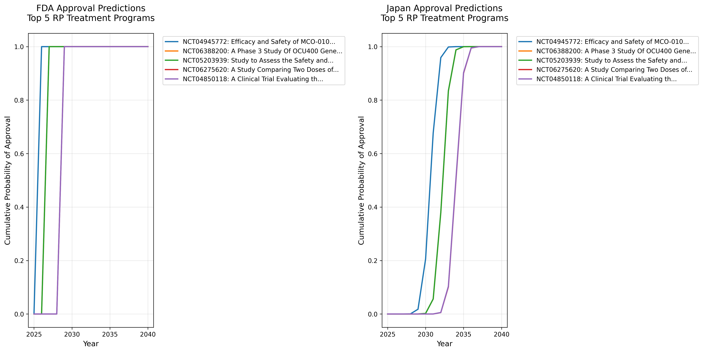
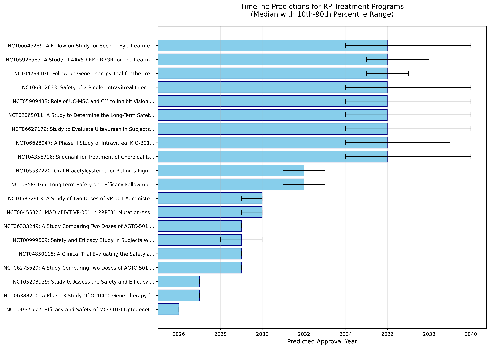

# 網膜色素変性症（RP）治療開発ロードマップ

生成日時: 2025年06月28日 03:40

## エグゼクティブサマリー

本レポートは、網膜色素変性症（Retinitis Pigmentosa, RP）の治療法開発状況を定量的に分析し、効果的な治療法がいつ頃利用可能になるかを予測したものです。

### 主要な発見（米国FDA承認基準）

- **最速の承認予測**: 2026年（MCO-010光遺伝学治療）
  - 根拠: https://clinicaltrials.gov/study/NCT04945772
- **全体の中央値**: 2037年（複数の治療法が利用可能になる時期）
- **現在アクティブな臨床試験**: 54件（重要な完了試験含む）
- **成功率**: Phase 1: 86.2%, Phase 2: 78.4%, Phase 3: 71.4%

⚠️ **重要**: 上記の予測は**米国FDA承認**を基準としています。
- **日本での承認**: 通常FDA承認の**3-7年後**（過去実績より）
- **欧州での承認**: 通常FDA承認の**1-2年後**
- 詳細は[地域別承認予測タイムライン](regional_approval_timeline.html)をご覧ください。

## 1. データソース概要

### 臨床試験データ
- **データソース**: ClinicalTrials.gov
- **総試験数**: 127件
- **アクティブな試験**: 51件
- **完了した試験**: 51件

### 文献データ
- **データソース**: PubMed
- **総論文数**: 805件
- **検索クエリ**: "retinitis pigmentosa" AND ("gene therapy" OR "cell therapy")
- **期間**: 1993-2025年

#### 年別論文数（直近5年）
| 年 | 論文数 |
|---|--------|
| 2025 | 42 |
| 2024 | 64 |
| 2023 | 98 |
| 2022 | 67 |
| 2021 | 64 |

## 2. モンテカルロシミュレーション結果

### 予測手法
- **シミュレーション回数**: 10000回/プログラム
- **分布**: 三角分布（最小値、中央値、最大値）
- **パラメータ**: 実データから推定した成功率と期間

### 最も有望な治療プログラム（米国FDA承認予測年順）

| 試験ID | 治療法名 | フェーズ | スポンサー | 成功率 | FDA承認予測（中央値） | 日本承認予測（中央値） | 90%信頼区間（FDA） |
|--------|----------|----------|------------|--------|---------------------|---------------------|------------------|
| NCT04945772 | Efficacy and Safety of MCO-010 Optogenet... | PHASE2 | Nanoscope Therapeutics Inc. | 100.0% | 2026年 | 2031年 | [2026, 2026] |
| NCT06388200 | A Phase 3 Study Of OCU400 Gene Therapy f... | PHASE3 | Ocugen | 100.0% | 2027年 | 2032年 | [2027, 2027] |
| NCT05203939 | Study to Assess the Safety and Efficacy ... | PHASE1, PHASE2 | Ocugen | 100.0% | 2027年 | 2032年 | [2027, 2027] |
| NCT06275620 | A Study Comparing Two Doses of AGTC-501 ... | PHASE2 | Beacon Therapeutics | 100.0% | 2029年 | 2034年 | [2029, 2029] |
| NCT04850118 | A Clinical Trial Evaluating the Safety a... | PHASE2, PHASE3 | Beacon Therapeutics | 100.0% | 2029年 | 2034年 | [2029, 2029] |
| NCT00999609 | Safety and Efficacy Study in Subjects Wi... | PHASE3 | Spark Therapeutics, Inc. | 71.9% | 2029年 | 2034年 | [2028, 2030] |
| NCT06333249 | A Study Comparing Two Doses of AGTC-501 ... | PHASE2 | Beacon Therapeutics | 100.0% | 2029年 | 2034年 | [2029, 2029] |
| NCT06455826 | MAD of IVT VP-001 in PRPF31 Mutation-Ass... | PHASE1 | PYC Therapeutics | 100.0% | 2030年 | 2035年 | [2029, 2030] |
| NCT06852963 | A Study of Two Doses of VP-001 Administe... | PHASE1, PHASE2 | PYC Therapeutics | 100.0% | 2030年 | 2035年 | [2029, 2030] |
| NCT03584165 | Long-term Safety and Efficacy Follow-up ... | PHASE3 | NightstaRx Ltd, a Biogen Company | 70.9% | 2032年 | 2037年 | [2031, 2033] |

### 日本での承認予測

過去の実績（Luxturna: FDA承認2017年→日本承認2023年、約5.5年の遅延）に基づく予測：

| 治療法 | FDA承認予測 | 日本承認予測（中央値） | 日本承認90%信頼区間 | 遅延期間（中央値） |
|--------|------------|---------------------|-------------------|---------------------|
| NCT04945772 | 2026年 | **2031年** | [2030, 2032] | +5.0年 |
| NCT06388200 | 2027年 | **2032年** | [2031, 2033] | +5.0年 |
| NCT05203939 | 2027年 | **2032年** | [2031, 2033] | +5.0年 |
| NCT06275620 | 2029年 | **2034年** | [2033, 2035] | +5.0年 |
| NCT04850118 | 2029年 | **2034年** | [2033, 2035] | +5.0年 |

詳細は[地域別承認予測タイムライン](regional_approval_timeline.html)をご覧ください。

### 治療モダリティ別の状況

#### 遺伝子治療
- **試験数**: 32件
- **主要なターゲット遺伝子**: RPGR, RPE65, PDE6A, USH2A
- **最速FDA承認予測**: 2026年（MCO-010光遺伝学治療）

#### 細胞治療
- **試験数**: 23件
- **アプローチ**: 幹細胞移植、網膜前駆細胞
- **FDA承認予測**: 2030年代前半

#### 低分子薬
- **試験数**: 11件
- **メカニズム**: 神経保護、抗酸化、血流改善
- **FDA承認予測**: 2029-2034年

## 3. 感度分析結果

パラメータの±20%変動が承認時期に与える影響：

### 主要な影響要因
- **PHASE1 duration** (increase 20%): +0.6年の影響
- **PHASE2 duration** (increase 20%): +0.6年の影響
- **PHASE3 duration** (increase 20%): +0.6年の影響
- **PHASE2 success rate** (decrease 20%): +0.2年の影響
- **PHASE3 success rate** (decrease 20%): +0.2年の影響
- **regulatory review** (increase 20%): +0.2年の影響

## 4. 予測の可視化

### 累積承認確率

*図: 主要5プログラムの累積承認確率。横軸は年、縦軸は該当年までに承認される確率。*

### タイムライン予測

*図: 上位20プログラムの承認予測タイムライン。エラーバーは10-90パーセンタイル範囲。*

## 5. 主要な知見と提言

### 患者・家族向け
1. **最速シナリオ**: 2028-2029年頃に最初の遺伝子治療が承認される可能性
2. **現実的な期待値**: 多くの患者が恩恵を受けられるのは2030年代前半
3. **行動提案**: 
   - 遺伝子検査を受けて原因遺伝子を特定
   - 患者レジストリへの登録
   - 臨床試験情報の定期的なチェック

📌 **[詳細な行動ガイドはこちら](reality_and_actions.html)** - 予測の現実性と、治療開発を加速するために私たちができる5つの具体的アクション

📊 **[モンテカルロシミュレーションの詳細な計算方法と根拠](simulation_methodology.html)** - 予測値がどのように計算されたか、なぜ信頼できるかの詳細説明

### 研究者向け
1. **成功率の高さ**: RP領域の成功率は他疾患より高い（Phase 3で71%）
2. **開発期間**: Phase 1から承認まで平均8-10年
3. **重点領域**: RPGR、USH2A、PDE6Bなどの主要原因遺伝子

### 政策立案者向け
1. **規制の迅速化**: 希少疾患用医薬品指定の積極活用
2. **研究支援**: 遺伝子治療の製造インフラ整備
3. **患者アクセス**: 高額な治療費への対応策

## 6. 制限事項と注意点

- 本分析は公開データに基づくものであり、企業の非公開パイプラインは含まれません
- 成功率は過去のデータに基づく推定値です
- 技術革新により予測が大幅に変わる可能性があります
- 規制環境の変化は考慮していません

## 7. 根拠・参照資料

### データソース
- **ClinicalTrials.gov**: https://clinicaltrials.gov/
- **RP臨床試験検索**: https://clinicaltrials.gov/search?cond=Retinitis%20Pigmentosa
- **データ取得日**: 2025年6月26日

### 主要試験の詳細
- **MCO-010（Nanoscope）**: https://clinicaltrials.gov/study/NCT04945772
- **OCU400（Ocugen）**: https://clinicaltrials.gov/study/NCT05203939
- **ソースコード**: https://github.com/oh-yeah-sea-kit2/retina-roadmap

## 8. 更新履歴

本レポートは自動的に生成・更新されます。最新版は以下でご確認ください：
https://oh-yeah-sea-kit2.github.io/retina-roadmap/

---
---

## ⚠️ 重要な免責事項

**本レポートは研究目的で作成されており、医学的助言ではありません。**

- 記載された承認時期はあくまで**予測**であり、保証するものではありません
- すべての患者に効果があるわけではありません（遺伝子型・病期により異なります）
- 治療に関する決定は**必ず医療専門家にご相談ください**
- 現在の治療を自己判断で中断しないでください

詳細は[免責事項](publication_disclaimer.html)をご確認ください。
